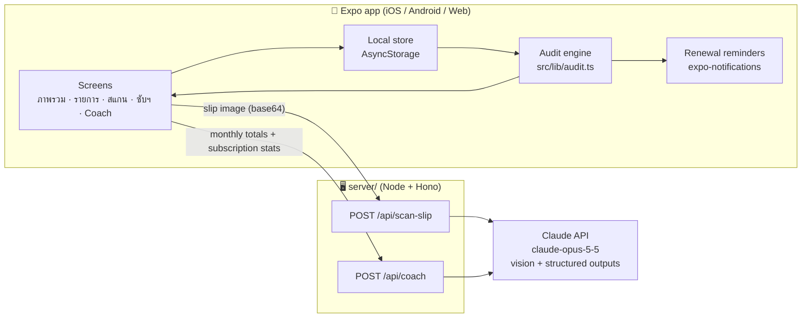

# AI Finance Coach & Subscription Audit

แอปจัดการค่าใช้จ่ายที่ไม่ต้องพิมพ์เองทั้งหมด — **สแกนสลิปให้ AI อ่านและจัดหมวดหมู่อัตโนมัติ** พร้อมระบบ **ตรวจสอบค่าซับสคริปชัน** (Streaming, AI Tools, Apps) ที่ไม่ค่อยได้ใช้ แจ้งเตือนก่อนตัดเงิน และ AI Coach แนะนำวิธีประหยัด

Expense tracker that reads Thai payment slips with Claude, audits subscriptions by actual usage, reminds you before renewals, and coaches you on where to save.

## ฟีเจอร์ (Features)

| หน้าจอ | ทำอะไร |
|---|---|
| **ภาพรวม** | ยอดใช้จ่ายเดือนนี้ เทียบช่วงเดียวกันเดือนก่อน, แยกตามหมวด, ซับสคริปชันที่จะตัดเงินใน 7 วัน, การ์ดเตือน "ประหยัดได้ ฿X/เดือน" |
| **สแกนสลิป** | ถ่ายรูป/เลือกสลิป (K PLUS, SCB EASY, Krungthai NEXT, PromptPay, ใบเสร็จร้านค้า) → Claude อ่านร้านค้า ยอดเงิน วันที่ (แปลง พ.ศ. → ค.ศ.) และหมวดหมู่ → ผู้ใช้ตรวจแก้ก่อนบันทึก → ถ้าเป็นค่าซับสคริปชัน เสนอให้ติดตามต่อ |
| **รายการ** | รายการทั้งหมดแยกตามเดือน กรองตามหมวด กดค้างเพื่อลบ |
| **ซับสคริปชัน** | ค่าใช้จ่ายรวมต่อเดือน/ปี, ตรวจจับรายจ่ายที่น่าจะเป็นซับสคริปชันอัตโนมัติ, คะแนนความคุ้มค่าจากการใช้งานจริง 30 วัน (ไม่ได้ใช้ / ใช้น้อย / คุ้มค่า / เพิ่งสมัคร), ต้นทุนต่อครั้ง |
| **รายละเอียดซับฯ** | ปุ่ม "ใช้วันนี้" บันทึกการใช้งาน, ประวัติ, แจ้งเตือนก่อนตัดเงิน (local notification), ทำเครื่องหมายว่ายกเลิกแล้ว |
| **AI Coach** | วิเคราะห์ในเครื่อง (ใช้ได้ทันทีไม่ต้องมีเซิร์ฟเวอร์) หรือส่งยอดสรุปให้ Claude วิเคราะห์ + ถามคำถามได้ |

ข้อมูลเก็บในเครื่อง (AsyncStorage) และเปิดแอปครั้งแรกจะมีข้อมูลตัวอย่างให้ดู

## สถาปัตยกรรม (Architecture)



- **ทำไมต้องมีเซิร์ฟเวอร์?** API key ของ Claude ห้ามฝังในแอปมือถือ (ใครก็แกะได้) จึงให้ `server/` เป็นตัวกลางถือ key ไว้
- **ความเป็นส่วนตัว:** AI Coach ส่งไปเฉพาะยอดรวมรายหมวดและสถิติซับสคริปชัน ไม่ส่งรายการธุรกรรมรายตัว
- **ทำงานแบบออฟไลน์ได้:** ถ้าไม่ได้ตั้งค่าเซิร์ฟเวอร์ แอปยังใช้งานได้ครบ ยกเว้นการอ่านสลิปอัตโนมัติ (กรอกเอง) และ AI Coach จะใช้กฎวิเคราะห์ในเครื่องแทน

### โครงสร้างโค้ด

```
src/
  app/                    # Expo Router — 1 ไฟล์ = 1 หน้าจอ
    (tabs)/               # แท็บล่าง: index, transactions, scan, subscriptions, coach
    subscription/[id].tsx # รายละเอียดซับสคริปชัน
    subscription/new.tsx  # เพิ่ม/แก้ไขซับสคริปชัน
    transaction/new.tsx   # เพิ่มรายจ่ายเอง
  components/             # UI ที่ใช้ร่วมกัน
  lib/
    audit.ts              # คำนวณความคุ้มค่า, วันตัดเงิน, ตรวจจับรายจ่ายซ้ำ
    analytics.ts          # สรุปรายเดือน + AI Coach แบบออฟไลน์
    subscription-catalog.ts # บริการยอดนิยม + ราคาอ้างอิง
    notifications.ts      # แจ้งเตือนก่อนตัดเงิน
    api.ts                # เรียก server/
    __tests__/            # unit tests
server/
  src/claude.ts           # prompt + schema สำหรับอ่านสลิปและ coach
  src/index.ts            # HTTP API, validation, rate limit
```

## เริ่มต้นใช้งาน (Getting started)

ต้องมี Node.js 22 LTS และแอป [Expo Go](https://expo.dev/go) บนมือถือ

### 1. รันแอป

```bash
npm install
npm start          # สแกน QR ด้วย Expo Go หรือกด w เพื่อเปิดบนเว็บ
```

### 2. (ไม่บังคับ) รันเซิร์ฟเวอร์ AI เพื่อเปิดการสแกนสลิปและ AI Coach

```bash
cd server
npm install
cp .env.example .env   # ใส่ ANTHROPIC_API_KEY จาก https://console.anthropic.com/
npm run dev            # http://localhost:8787
```

แล้วสร้างไฟล์ `.env.local` ที่ root ของโปรเจกต์ (ใช้ IP เครื่องคอมในวง LAN เดียวกับมือถือ):

```bash
EXPO_PUBLIC_API_URL=http://192.168.1.10:8787
```

แล้วรัน `npm start` ใหม่

### คำสั่งอื่นๆ

```bash
npm test            # unit tests (audit / analytics / dates)
npm run typecheck
npm run lint
cd server && npm run typecheck
```

## การเรียกใช้ Claude

- โมเดล `claude-opus-5-5` + **structured outputs** (Zod schema) เพื่อให้ได้ JSON ที่ถูกต้องเสมอ
- อ่านสลิปใช้ `effort: "low"` (เร็ว/ถูก), Coach ใช้ `effort: "medium"`
- เปิด `fallbacks: "default"` (beta `server-side-fallback-2026-07-01`) — ถ้าโมเดลหลักปฏิเสธคำขอ API จะส่งต่อให้โมเดลสำรองอัตโนมัติ และโค้ดจัดการ `stop_reason: "refusal"` ไว้แล้ว
- จำกัดขนาดรูป 5MB และ rate limit 30 ครั้ง/10 นาที/IP

## ข้อจำกัดและสิ่งที่ควรทำต่อ (Roadmap)

- [ ] **ติดตามการใช้งานแอปอัตโนมัติ** — ตอนนี้ผู้ใช้กด "ใช้วันนี้" เอง; Android ทำอัตโนมัติได้ผ่าน `UsageStatsManager` (ต้องใช้ development build + config plugin), iOS จำกัดมาก (Screen Time API ต้องขอ entitlement จาก Apple)
- [ ] **ระบบบัญชีผู้ใช้ + sync ข้ามเครื่อง** (เช่น Supabase) และ auth ที่ server แทน rate limit ตาม IP
- [ ] อ่านอีเมลใบเสร็จ (Gmail) / SMS ธนาคาร เพื่อเจอซับสคริปชันที่ตัดผ่านบัตรเครดิต
- [ ] เพิ่มงบประมาณรายหมวด + กราฟแนวโน้มรายเดือน
- [ ] ลิงก์ไปหน้ายกเลิกของแต่ละบริการ
- [ ] Build จริงด้วย EAS (`npx eas-cli@latest build`)

## Branches
- `main` – โค้ดที่พร้อมใช้งาน (stable)
- `develop` – สำหรับพัฒนา (integration branch)
- `feature/<name>` – ฟีเจอร์ใหม่ แตกจาก `develop`
